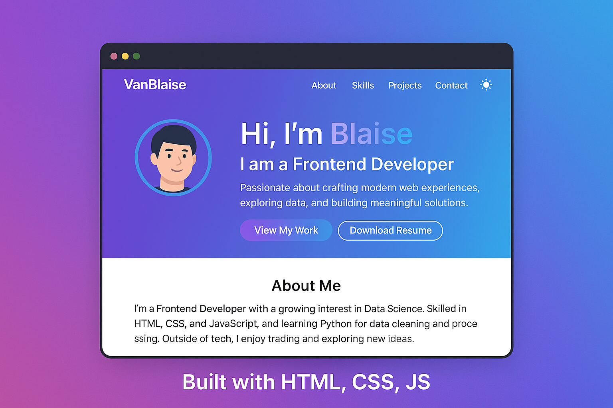

# 🌟 My Portfolio Website

Welcome to my personal portfolio repository!  
This project is built with **pure HTML, CSS, and JavaScript** — no frameworks — to highlight my **strong foundational frontend skills**.

🔗 **Live Portfolio:** [View Here](https://vanblaise.github.io/)

---

## ✨ Features
- 🎨 **Modern Tech Vibe UI** – Colorful gradient theme with smooth animations.
- 🌓 **Light/Dark Theme Toggle** – Saves user preference with localStorage.
- ⌨️ **Animated Typing Header** – Showcases my roles & interests dynamically.
- 📂 **Filterable Projects Section** – Easily browse through categories.
- 📱 **Responsive Design** – Fully optimized for mobile, tablet, and desktop.

---

## 💻 Technologies Used
- **HTML5** – Semantic and accessible markup.
- **CSS3** – Custom properties, flexbox, grid, and animations.
- **JavaScript (ES6)** – DOM manipulation, event handling, localStorage.

---

## 📸 Preview
  
*(You can update this screenshot by taking one of your live site)*

---

## 🧠 About Me
Hi, I’m **Blaise** 👋  
I’m a **Frontend Developer** with a growing passion for **Data Science**.  
I also have experience with:
- HTML, CSS, JavaScript
- Python for data cleaning and processing
- Git/GitHub for version control

📫 **Contact me:** [vandu.emmanuel@gmail.com](mailto:vandu.emmanuel@gmail.com)

---

## 🚀 How to Run Locally
```bash
# Clone the repo
git clone https://github.com/VanBlaise/portfolio.git

# Open index.html in your browser
